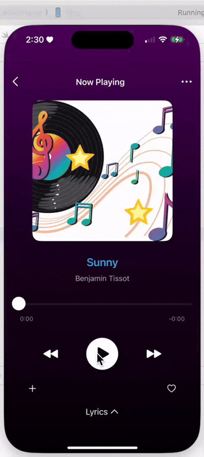

## Project Description

**AVKitPlayer** is an iOS app built with **AVFoundation**, **AVKit**, and **SwiftUI** to handle audio and video playback.

- **Music Player**: Stream and control audio, with features like play/pause, progress bar, and background playback.
- **Video Player**: Stream video with support for **Picture-in-Picture (PiP)** mode on compatible devices.

---

  

Key Features:
- Play/pause and seek audio and video.
- Picture-in-Picture support for video.
- Background audio playback.
- Clean UI with media details (title, artist, album art).
- Seamless integration of **AVKit** for simplified media playback controls and **AVFoundation** for advanced media management.

This project is perfect for applications that require simple media control with minimal code, while still providing deeper customizations through AVFoundation when necessary.

  

---

## Integrating AVKit with SwiftUI: A Practical Guide to Media Playback

[Here is the full article on integrating AVKit with SwiftUI.](https://medium.com/@hmp.ucsm/integrating-avkit-with-swiftui-a-practical-guide-to-media-playback-63dafffca647)

 

## What’s AVKit?

**AVKit** is an Apple framework that simplifies creating user interfaces for **media playback**. It provides built-in user interfaces with:

1. Transport controls (play, pause, etc.)
2. Chapter navigation
3. Picture-in-picture support
4. Subtitles and closed captions display

AVKit is built on top of **AVFoundation**, making it easy to implement media features like video and audio playback without having to build these components from scratch.

---
## AVKit vs AVFoundation

- **AVKit** is the simplified, high-level option for basic media playback.
- **AVFoundation** is the low-level, powerful framework for detailed media control and customization.

 

### Key Differences

| Feature              | AVKit                                   | AVFoundation                            |
|----------------------|-----------------------------------------|-----------------------------------------|
| **Ease of Use**       | High (ready-made player controls)       | Low (requires custom controls)          |
| **UI Controls**       | Built-in player UI                     | No built-in UI; custom needed           |
| **Customization**     | Limited (basic playback)               | Extensive (custom media handling)       |
| **Advanced Features** | Limited (basic playback)               | Extensive (editing, recording, etc.)    |
| **Use Case**          | Simple media playback                  | Complex media handling and processing   |
| **Integration**       | Quick to integrate                     | Requires more setup and code           |

This table compares the key features of **AVKit** and **AVFoundation**, helping you decide which framework to use based on your project’s needs.

 

---

## When to Use Each

- **AVKit** is best when you need quick, simple media playback with minimal code. It’s perfect for displaying videos or audio with default controls (ready-to-go media playback).

- **AVFoundation** is for apps that need advanced control over media, like custom video players, media processing, or integration with other media features like recording and editing. (detailed control, e.g., adding video effects, recording, streaming, etc.)

 

## Contact Information

**Moe**  
**iOS Developer**  
**Htet Moe Phyu**  
Email: [htetmoephyu9@gmail.com](mailto:htetmoephyu9@gmail.com)  
LinkedIn: [https://www.linkedin.com/in/htet-phyu/](https://www.linkedin.com/in/htet-phyu/)

## Thank You!

Thank you for reading this guide on integrating **AVKit** with **SwiftUI**! I hope you found it helpful. If you have any questions or feedback, feel free to reach out. Happy coding!
